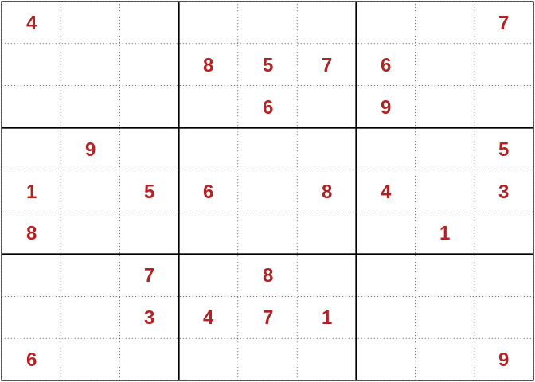
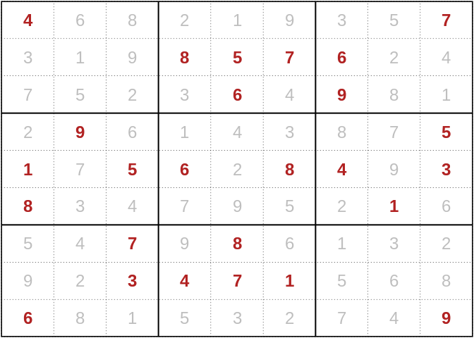

<!-- README.md is generated from README.Rmd. Please edit that file -->

<!-- badges: start -->

[](https://github.com/tjtnew/sudsolve/actions)
<!-- badges: end -->

# sudsolve

`sudsolve` is a small personal project that I’ve used to get my head
around both C code and how to use it with `R`. It provides a single user
facing function, `sudsolve`, that will solve any standard (9 by 9)
sudoku puzzle.

## Installation

You can install from [GitHub](https://github.com/) with:

``` r
# install.packages("devtools")
devtools::install_github("tjtnew/sudsolve")
```

## Overview

The solver works in two stages. Firstly, human-like methods are employed
to fill in the sudoku as much as possible. Currently this is done by
looking for both [lone](https://www.learn-sudoku.com/lone-singles.html)
and [hidden](https://www.learn-sudoku.com/hidden-singles.html) singles.
Secondly, we employ a brute-force recursive approach to fill in the
remaining squares.

The code is not pretty but gets the job done relatively quickly. For
those looking for some very elegant `R` code please look at the CRAN
package [sudokuAlt](https://cran.r-project.org/web/packages/sudokuAlt/)
by Bill Venables. It’a a fantastic little package that shows just how
beautiful and succinct R code can be\!

## Example

Puzzles can be defined as matrices with either zeros or NAs representing
missing values. The output is then returned to the user in a similar
form.

``` r
library(sudsolve)

r1 <- c(0, 0, 0, 7, 0, 0, 0, 0, 0)
r2 <- c(1, 0, 0, 0, 0, 0, 0, 0, 0)
r3 <- c(0, 0, 0, 4, 3, 0, 2, 0, 0)
r4 <- c(0, 0, 0, 0, 0, 0, 0, 0, 6)
r5 <- c(0, 0, 0, 5, 0, 9, 0, 0, 0)
r6 <- c(0, 0, 0, 0, 0, 0, 4, 1, 8)
r7 <- c(0, 0, 0, 0, 8, 1, 0, 0, 0)
r8 <- c(0, 0, 2, 0, 0, 0, 0, 5, 0)
r9 <- c(0, 4, 0, 0, 0, 0, 3, 0, 0)

game <- rbind(r1,r2,r3,r4,r5,r6,r7,r8,r9)
solution <- sudsolve(game)
solution
```

    #>       [,1] [,2] [,3] [,4] [,5] [,6] [,7] [,8] [,9]
    #>  [1,] "2"  "6"  "4"  "7"  "1"  "5"  "8"  "3"  "9" 
    #>  [2,] "1"  "3"  "7"  "8"  "9"  "2"  "6"  "4"  "5" 
    #>  [3,] "5"  "9"  "8"  "4"  "3"  "6"  "2"  "7"  "1" 
    #>  [4,] "4"  "2"  "3"  "1"  "7"  "8"  "5"  "9"  "6" 
    #>  [5,] "8"  "1"  "6"  "5"  "4"  "9"  "7"  "2"  "3" 
    #>  [6,] "7"  "5"  "9"  "6"  "2"  "3"  "4"  "1"  "8" 
    #>  [7,] "3"  "7"  "5"  "2"  "8"  "1"  "9"  "6"  "4" 
    #>  [8,] "9"  "8"  "2"  "3"  "6"  "4"  "1"  "5"  "7" 
    #>  [9,] "6"  "4"  "1"  "9"  "5"  "7"  "3"  "8"  "2"

## Nicer output

`sudsolve` can also take advantage of the display and plotting
capability of
[sudokuAlt](https://cran.r-project.org/web/packages/sudokuAlt/)

``` r
library(sudokuAlt)

r1 <- c(4, 0, 0, 0, 0, 0, 0, 0, 7)
r2 <- c(0, 0, 0, 8, 5, 7, 6, 0, 0)
r3 <- c(0, 0, 0, 0, 6, 0, 9, 0, 0)
r4 <- c(0, 9, 0, 0, 0, 0, 0, 0, 5)
r5 <- c(1, 0, 5, 6, 0, 8, 4, 0, 3)
r6 <- c(8, 0, 0, 0, 0, 0, 0, 1, 0)
r7 <- c(0, 0, 7, 0, 8, 0, 0, 0, 0)
r8 <- c(0, 0, 3, 4, 7, 1, 0, 0, 0)
r9 <- c(6, 0, 0, 0, 0, 0, 0, 0, 9)

game <- rbind(r1,r2,r3,r4,r5,r6,r7,r8,r9)
game <- as.sudoku(game)
plot(game)
```



``` r
game %>% sudsolve() %>% plot()
```


